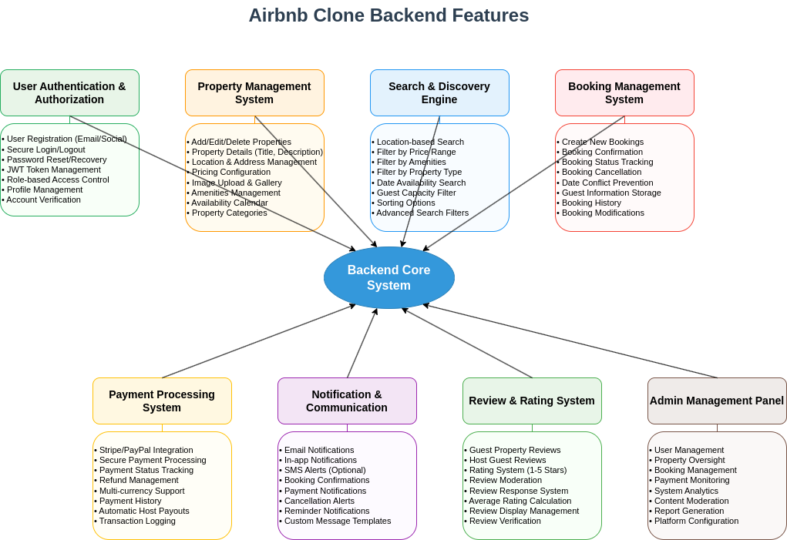

# 🧾 Features and Functionalities – Airbnb Clone Backend

## 🎯 Objective

This document outlines and visualizes all the key **features** and **functionalities** that the backend of the Airbnb Clone must support. It is based on the official project requirements and is intended to guide the system design and implementation process.

---

## 📌 Overview

The backend of the Airbnb Clone is designed to serve as the core engine powering a rental marketplace platform. It handles everything from user management and property listings to booking flows and secure payments.

The diagram in this directory provides a clear, categorized structure of all backend functionalities, ensuring every component is accounted for.

---

## 📂 Functional Areas

The core functionalities are grouped into the following domains:

### 1. 🧑‍💼 User Management
- Guest & Host Registration
- Login (Email/Password + OAuth)
- Profile Updates
- Role-based Permissions (Guest, Host, Admin)

### 2. 🏠 Property Management
- Create Listings (title, description, price, location, amenities)
- Update/Delete Listings (Host only)
- Upload Images

### 3. 🔍 Search & Filtering
- Search by Location, Price, Guests, Amenities
- Pagination and sorting for performance

### 4. 📆 Booking System
- Book Property with Date Validation
- Cancel Bookings (based on role/policy)
- View Booking Status

### 5. 💳 Payment Processing
- Integration with Payment Gateways (Stripe, PayPal)
- Guest → Pay for Booking
- Host → Receive Payouts
- Multi-Currency Support

### 6. 🌟 Reviews & Ratings
- Guest → Write Review
- Host → Respond to Review
- Link Reviews to Bookings

### 7. 🔔 Notifications System
- Email & In-app Alerts for:
  - Booking Confirmation
  - Cancellations
  - Payment Updates

### 8. 🛡️ Admin Controls
- Manage Users, Listings, Bookings, and Transactions
- System Monitoring and Reporting

---

## 🖼️ Diagram Preview

The diagram below presents a visual breakdown of all backend features and how they relate to each other.

  

