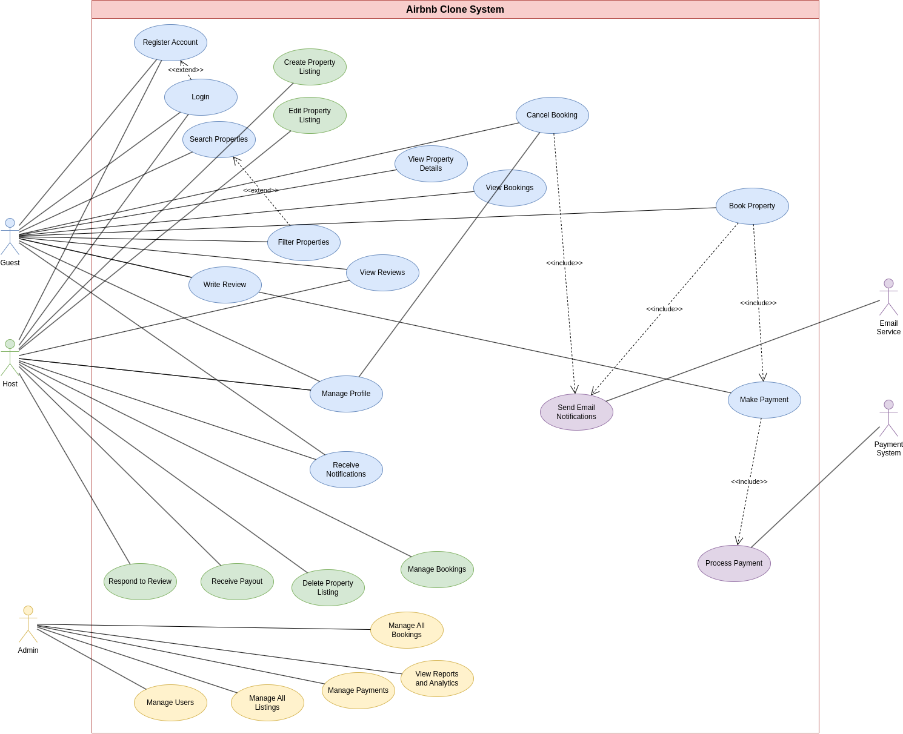

# ✅ Use Case Diagram – Airbnb Clone Backend

## 🎯 Objective

This document presents the **Use Case Diagram** for the Airbnb Clone backend. The diagram is designed to visualize the interactions between key actors (users and system components) and the core functionalities provided by the backend system.

The goal is to provide a clear, high-level overview of the main features and how different user roles interact with them.

---

## 👥 Key Actors

- **Guest**
- **Host**
- **Admin**
- **Payment Service**
- **Email/Notification Service**

---

## 🔑 Use Cases and Interactions

The system supports the following use cases based on the project requirements:

### 1. **User Management**
- Register (as Guest or Host)
- Login (via Email/Password or OAuth)
- Manage Profile

### 2. **Property Listings**
- Add Property (Host)
- Edit/Delete Property (Host)
- View Listings (Guest)

### 3. **Search & Filter**
- Search by location, price, amenities, guests
- Use pagination for large datasets

### 4. **Booking Management**
- Book Property (Guest)
- Cancel Booking (Guest/Host)
- View Booking Status

### 5. **Payment Integration**
- Pay for Booking (Guest → Payment Service)
- Payout to Host (System → Host via Payment Service)

### 6. **Reviews & Ratings**
- Leave Review (Guest)
- Respond to Review (Host)

### 7. **Notifications**
- Receive Booking Confirmation, Cancellations, Payment Updates (via Email/Notifications)

### 8. **Admin Management**
- Monitor Users, Listings, Bookings, Payments

---

## 📊 Diagram Preview

The Use Case Diagram is created using **Draw.io** and represents all major actors and their interactions with the system.

  

> **Note**: For a high-resolution version of the diagram, view `airbnb-use-case.png` in this directory.